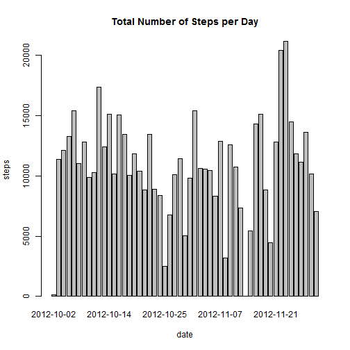
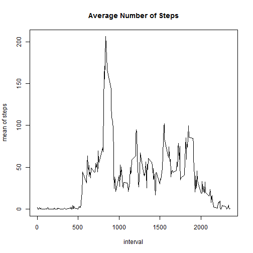
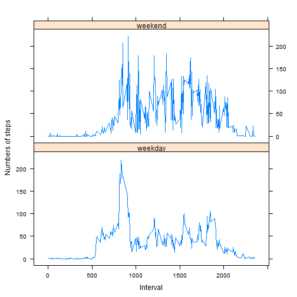

Peer Assignment 1
========================================================
Loading and preprocessing the data

```r
data <- read.csv("activity.csv")
data <- data.frame(data)
```


Histogram of the total number of steps taken each day


```r
DataNoNA <- data[complete.cases(data), ]
DataNoNA[, 2] <- as.character(DataNoNA[, 2])
stepsD <- tapply(DataNoNA$steps, DataNoNA$date, sum)
barplot(stepsD, xlab = "date", ylab = "steps", main = "Total Number of Steps per Day")
```

 


Calculate and report the mean and median total number of steps taken per day

```r
mean(stepsD)
```

```
## [1] 10766
```

```r
median(stepsD)
```

```
## [1] 10765
```


A time series plot (i.e. type = "l") of the 5-minute interval (x-axis) and the average number of steps taken, averaged across all days (y-axis)

```r
stepsI <- tapply(DataNoNA$steps, DataNoNA$interval, mean)
plot(names(stepsI), stepsI, type = "l", xlab = "interval", ylab = "mean of steps", 
    main = "Average Number of Steps")
```

 


Which 5-minute interval,average across all the days in the dataset, contains the maximum number of steps?

```r
names(stepsI[stepsI == max(stepsI)])
```

```
## [1] "835"
```


Imputing missing values

```r
nrow(data) - sum(complete.cases(data))
```

```
## [1] 2304
```

```r

NewData <- data
for (i in (1:nrow(data))[!complete.cases(data)]) {
    NewData[i, 1] <- stepsI[names(stepsI) == NewData[i, 3]]
}
```


Calculate total number of steps per day with new dataset

```r
stepsD2 <- tapply(NewData$steps, NewData$date, sum)
barplot(stepsD, xlab = "date", ylab = "steps", main = "Total Number of Steps per Day")
```

 


Mean and median

```r
mean(stepsD2)
```

```
## [1] 10766
```

```r
median(stepsD2)
```

```
## [1] 10766
```

After imputing missing values,median has been the same as the mean

Make a panel plot containing a time series plot with new factor variable

```r
NewData[, 2] <- as.Date(NewData[, 2])
Weekdays <- weekdays(NewData[, 2])

WeekendData <- NewData[Weekdays == c("Saturday", "Sunday"), ]
WeekdayData <- NewData[!Weekdays == c("Saturday", "Sunday"), ]

stepsIinWend <- tapply(WeekendData$steps, WeekendData$interval, mean)
stepsIinDay <- tapply(WeekdayData$steps, WeekdayData$interval, mean)

stepsEnd <- cbind(names(stepsIinWend), as.character(stepsIinWend), rep("weekend", 
    length(stepsIinWend)))
stepsDay <- cbind(names(stepsIinDay), as.character(stepsIinDay), rep("weekday", 
    length(stepsIinDay)))


stepsW <- rbind(stepsEnd, stepsDay)
stepsW <- data.frame(stepsW)
stepsW[, 1] <- as.numeric(as.character(stepsW[, 1]))
stepsW[, 2] <- as.character(stepsW[, 2])
stepsW[, 2] <- as.numeric(stepsW[, 2])
names(stepsW) <- c("interval", "steps", "week")


library(lattice)
xyplot(steps ~ interval | week, layout = c(1, 2), data = stepsW, type = "l", 
    ylab = "Numbers of steps", xlab = "Interval")
```

 


The End

